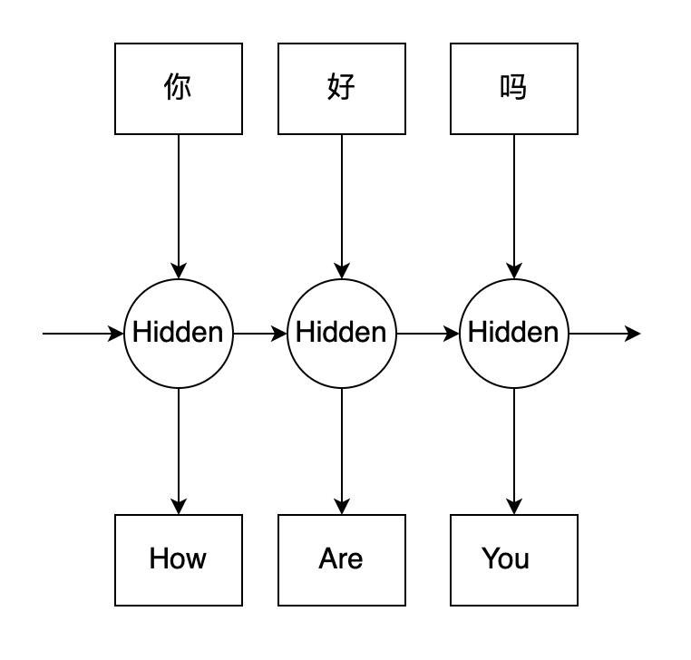
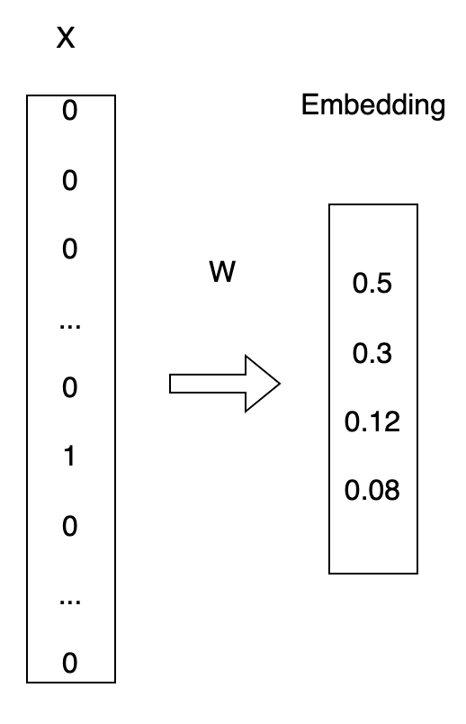
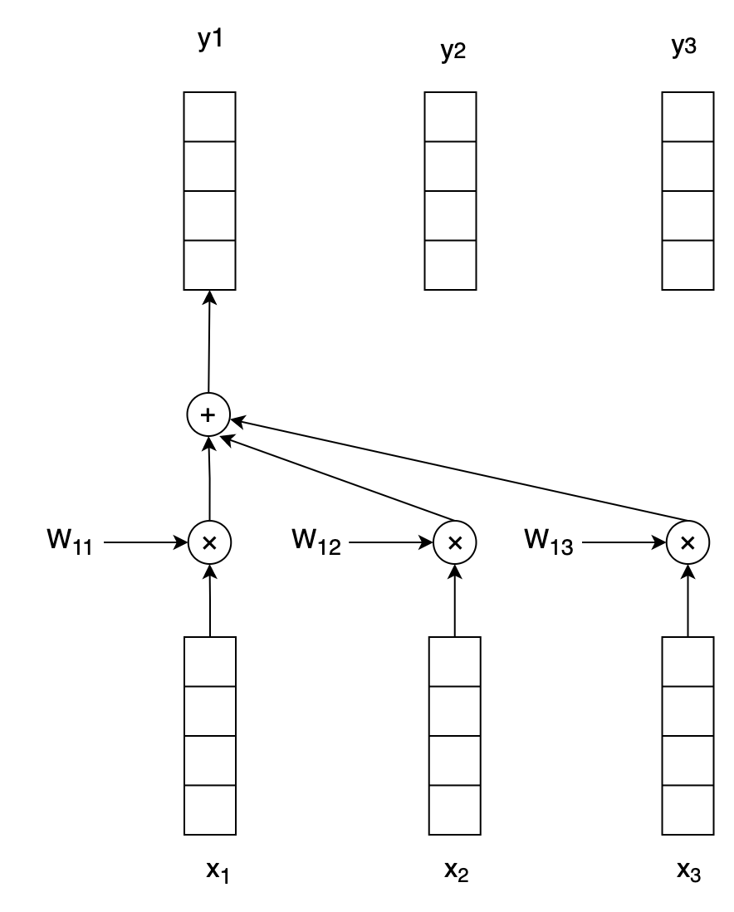
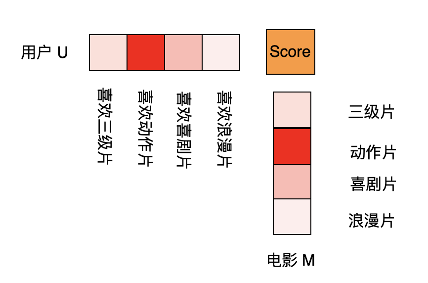
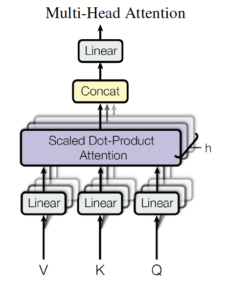

# Transformer从入门到入土

**Transformer是如今机器学习领域一个非常重要的网络架构, 这篇文章我们就来详细介绍Transformer是怎么工作的. 由于Transformer最初是用来解决NLP领域的问题, 因此本文我们也分三个部分来学习Transformer:**  

1. 循环神经网络系列(以RNN举例).  
2. Self-Attention.  
3. Transformer.

## 1. RNN翻译任务举例

&emsp;&emsp;假设有一句话 `你好吗`, 现在我们需要将其翻译成英文: `How ary you`, 使用RNN神经网络的结构通常是这样的:  
<div align="center">

</div>

&emsp;&emsp;由于循环神经网络的特性, 训练过程不能并行, 网络首先将`你`传递给隐藏神经元,翻译得到`How`,然后将上一次计算的隐藏层数据$h_1$和`好`一起传递给隐藏层,计算得到`Are`, 重复上述操作, 最后得到翻译的`You`. 显然这样需要进行三次循环才能完成一个句子(Sentence)的翻译任务. 在训练过程中有大量的训练sentence.  

&emsp;&emsp;在RNN计算过程中需要彻底弄清楚输入向量和输出向量的shape, 这里先了解几个概念:  

* **词典:** 场景中全部词汇, 例如:维基百科中出现的全部词汇(英文词典), 百度百科出现的全部汉字(汉语词典). 通常情况下英文中一个单词为一个"词", 汉语中一个字为一个"词"  

* **词典长度:** (vocabulary length) 词典中所有"词"的数量. 例如世界上常用的全部英文大约有2万个,那么词典长度voca_len=20000, 中文中常用的汉字有2000个, 中文词典长度voca_len=2000.  

* **词向量:** 针对每一个词我们怎么用向量的方式将其表达出来, 一中方式是`one-hot`方式, 即:假设一个词$a$在词典中的位置是第987个, 那么这个词用就可以标识为:
    $$
    a = [0,0,0,...,1,...,0,0,0]
    $$
    即: 第987位是1, 其它位全是0.  
    上面这种方式显然空间浪费非常大, 因此通常我们使用`Word Embedding(词嵌入)`的方式, 将一个词嵌入到低纬空间中:
    <div align="center">
    
    </div>  

    针对一个词向量
    $$x_1 = [0,0,0,...,1,0,...,0], shape:(1, voc\_len)$$
    初始化一个权重矩阵:
    $$W, shape:(voc\_len, embed\_size)$$  
    经过Embedding层计算最终得到输出:  
    $$ output = x_1 × W, shape:(1, embed\_size) $$  
    由此可见, 针对一个长度为n句子(sentence), 用one-hot矩阵表示形式为:
    $$
    X = \left[ \begin{matrix} 
    0 & 1 & 0 & ... & 0\\
    1 & 0 & 0 & ... & 0\\
    0 & 0 & 1 & ... & 0 \\
    ... & ... & ... & ... & ...\\
    0 & 0 & 0 & ... & 1 
    \end{matrix} \right],shape:(n, voc\_len)
    $$
    输入$X$到Embedding层, 最终得到一个shape为$(n, embed_size)$的向量. 仔细观察$output = X * W$就能发现, 一个由one-hot向量构成的矩阵乘以权重矩阵$W$得到的结果其实就是矩阵$W$对应one-hot向量中`1`元素的索引. 我们举个🌰看看:   
    假设:
    $$
    X = \left[ \begin{matrix} 
    0 & 1 & 0 & 0 & 0\\
    1 & 0 & 0 & 0 & 0\\
    0 & 0 & 1 & 0 & 0\\
    0 & 0 & 0 & 1 & 0
    \end{matrix} \right], 
    W = \left[ \begin{matrix} 
    w_{11} & w_{12} & w_{13}\\
    w_{21} & w_{22} & w_{23}\\
    w_{31} & w_{32} & w_{33}\\
    w_{41} & w_{42} & w_{43}\\
    w_{51} & w_{52} & w_{53}
    \end{matrix} \right]
    $$
    那么:
    $$
    output = X×W = \left[ \begin{matrix} 
    0 & 1 & 0 & 0 & 0\\
    1 & 0 & 0 & 0 & 0\\
    0 & 0 & 1 & 0 & 0\\
    0 & 0 & 0 & 1 & 0
    \end{matrix} \right] × \left[ \begin{matrix}
    w_{11} & w_{12} & w_{13}\\
    w_{21} & w_{22} & w_{23}\\
    w_{31} & w_{32} & w_{33}\\
    w_{41} & w_{42} & w_{43}\\
    w_{51} & w_{52} & w_{53}
    \end{matrix} \right] = \left[ \begin{matrix}
    w_{21} & w_{22} & w_{23}\\
    w_{11} & w_{12} & w_{13}\\
    w_{31} & w_{32} & w_{33}\\
    w_{41} & w_{42} & w_{43}
    \end{matrix} \right]
    $$
    由此可见, 我们其实没必要将$x_i$转换成one-hot编码形式, 只需要输入当前$x_i$所在词典中的索引即可.  

----
**有了上述基础知识之后, 下面我们需要思考一个问题: RNN由于其循环神经网络的特性, 每个句子训练学习过程中只能一个词计算完毕之后,再计算另一个词. 那么有没有一种方式能让网络同时模拟出RNN的<font color="red">上文相关性</font>, 又能并行训练学习? Attention机制其实干的就是这件事**  

## 2. Attention机制详解  

还是针对上述的翻译案例, 我们先看一幅图:
<div style="float:center;">
    
    
</div>

计算过程如下:
$$
y_1 = x_1 * w_{11} + x_2 * w_{12} + x_3 * w_{13} \\
y_2 = x_1 * w_{21} + x_2 * w_{22} + x_3 * w_{23} \\
y_3 = x_1 * w_{31} + x_2 * w_{32} + x_3 * w_{33}
$$
这时就能够做到并行计算, 其中参与计算的权重$w_{ij}$我们称之为: Attention值, 是一个标量, 说白了Attention就是做了一个权重再分配, 说人话就是: 计算$y_1$时,我到底应该更关注哪个输入?  

明白了Attention机制后, 接下来就需要确定Attention值是怎么计算得到的, 即:权重矩阵
$$
W = \left[ \begin{matrix} 
    w_{11} & w_{12} & ... & w_{1m}\\
    w_{21} & w_{22} & ... & w_{2m}\\
    w_{31} & w_{32} & ... & w_{3m}\\
    ... & ... & ... &...\\
    w_{m1} & w_{m2} & ... & w_{mm}
    \end{matrix} \right], 其中m表示序列(sequence)的长度.
$$
值是怎么计算得到的. 这时我们回到经典论文: **[Attention is All you Need](https://arxiv.org/abs/1706.03762)**, 论文中定义的Attention计算公式为:
$$
Attention(Q,K,V) = Softmax(\frac{QK^T}{\sqrt{d_k}})V
$$
这就好办了, 回到上面我绘制的那张图:


怎么计算Attention的值这张图应该一眼就能够看出来吧? 在计算$w_{11}$时,横着的$x_1$为Query, 竖着的$x_1$表示Key, 计算$w_{12}$时,横着的$x_1$为Query, 竖着的$x_2$表示Key, 计算$w_{13}$时,横着的$x_1$为Query, 竖着的$x_3$表示Key, 那么$w_{11}, w_{12},w_{13}$具体的计算表达式如下所示:  
$$
w_{1j} = \frac{e^{\frac{x_1{x_j}^T}{\sqrt{4}}}}{\sum_{j}{e^{\frac{x_1{x_j}^T}{\sqrt{4}}}}} * x_j
$$
公式中左边那一大坨就是$Softmax(QK^T)$, $x_j$就是$V$.  

## 3. 为什么Attention机制能够正常工作?
这一节我们主要来解释一下为什么Attention能够work. 假设在一个电影推荐的任务上,对一个电影归类我们假设有四个维度:`[三级片段, 动作片段, 喜剧片段, 浪漫片段]`, 对用户喜欢某种电影我们也设置四个维度:`[喜欢三级片, 喜欢动作片, 喜欢喜剧片, 喜欢浪漫片]`, 看下面一张图, 如何衡量用户$u$是否喜欢电影$m$? 
  
用户特征向量和电影特征向量相乘难道不就是我们熟悉的向量近似度计算公式? 如果向量$u$和向量$m$乘积越大, 说明这两个向量近似度越高, 否则说明这两个向量近似度越低. 

再仔细观察一下权重$w$的计算公式:
$$
w_{ij} = Softmax(\frac{x_i{x_j}^T}{\sqrt{d}})
$$
在计算Attention值时, 我们是否可以认为计算过程中关注那些相关度较高的词参与翻译的推理计算?  
例如: 给定一个句子:
$$
v_{the}, v_{cat}, v_{walks}, v_{on}, v_{the}, v_{street}
$$
我们要将其翻译成:
$$
y_{猫}, y_{走}, y_{在}, y_{街}, y_{上}
$$
在翻译$y_猫$的时候, 通过计算发现$v_{cat}$的权重最高,$v_{the}以及其他的权重较低$, 因此注意力有90\%集中在计算$v_{cat}$, 其他的权重就分配的较低.

有了上述2, 3节的知识点, 下面我们实现一个小小的Self-Attention的例子:

```python
import torch
import torch.nn.functional as F
# 用随机模拟生成一个批次为16, 句子长度为5, embedding_size为32的输入数据
x = torch.randn(16, 5, 32)
# 计算Attention权重W
W = torch.bmm(x, x.transpose(1,2))
# 加上softmax
W = F.softmax(W, dim=2)
# 输出到y
y = torch.bmm(W, x)
print(y)
```

# 4. 手撕Transformer

手撕Transformer之前再说一下一个东西: 多头注意力机制, 可以理解为多个头的注意力机制. 即: 在一个层上Attention计算了n次. 其中n为头的数量, 这个没什么好说的, 具体参考一下论文的图:



Transformer网络中还有个